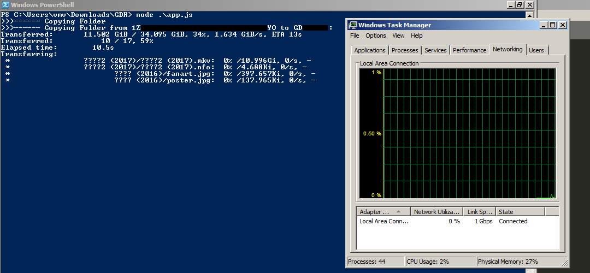

# Backup Google Drive Share Folder with rclone in Automation
The program allows you to backup **any Google Drive shared folder** to your Google Drive (or other cloud storage) in automation.

## Motivation
It is painful to backup tons of shared folder to Google Drive manually. Therefore, the program targets to:
1. Backup these folders to Google Drive **without using host bandwidth**, or
2. Backup these folders to other cloud storage (e.g., OneDrive).

## Instruction
1. Install [Node.js](https://nodejs.org/en/download/)
2. Install [rclone](https://rclone.org/downloads/) and [configure it](https://rclone.org/docs/#configure) (if you haven't).
2. Replace the `rclone.conf` with your rclone configuration. Use command `rclone config file` to see where your rclone configuration is located.
3. Ensure the `rclone.conf` conrains at least one remote with a working token.
4. Modify `list.txt` with the format of `folder_ID===rclone_destination`.
5. You are good to go. See the [Practical Case](#practical-case) before you run the program to see if it works.

The `rclone_destination` is in the format with [`dest:destpath`](https://rclone.org/commands/rclone_copy/).
The path doesn't need to have double quotes even if the path contains whitespace (tested on Windows7/10).

## Practical Case
We have [a known troll file contains all the Rickroll](https://drive.google.com/drive/folders/1N7rmP_1y4eo8bc75muJQPHXss-GgR1ja) (around 1 TB), and rclone is configured with a remote called `GD_team`. The remote has a folder called `trollYou`.
 
We want to backup that shared folder to the remote's folder. It is noted that
1. The folder ID of the shared link will be `1N7rmP_1y4eo8bc75muJQPHXss-GgR1ja`
2. The rclone destination will be `GD_team:trollYou`

By the information above, we shall have a line in the list.txt in the format of `N7rmP_1y4eo8bc75muJQPHXss-GgR1ja===GD_team:trollYou`, put it in `list.txt`.

Lanuch the application with `node app.js` in the terminal (i.e., Cmd, Powershell, etc.).

## Notes
1. If you don't have `rclone` in your path environment variable, you must change `rcloneCommand` in app.js to the path of `rclone` (e.g., `C:/rclone/rclone.exe` or wherever rclone is located).

2. The function of **without using host bandwidth only works when rclone destination is Google Drive remote**. See [rclone documentation](https://rclone.org/drive/#drive-server-side-across-configs) for details.

3. The `list.txt` are multi-lines allowed and theoretically unlimited lines allowed.

4. The drawback of the program is you have to update the `rclone.conf` each time before you run that, or the program may fail to run due to an expired token.
